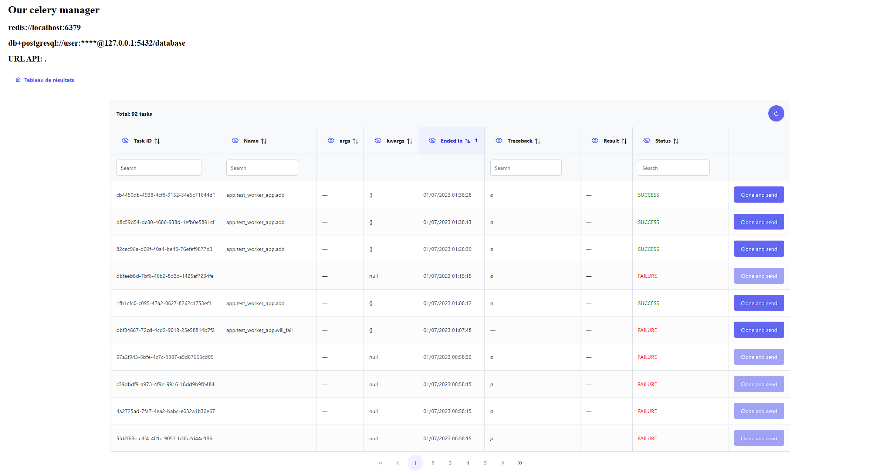

# Our Celery Manager

Operational tool around the message broker [Celery](https://docs.celeryproject.org/en/stable/index.html).

Specifically, it is a query interface for tasks stored in the [result backend](https://docs.celeryq.dev/en/stable/userguide/configuration.html#task-result-backend-settings).

*This tool is only compatible with a result backend that uses a SQL database.*

## Development Documentation

[DEV_README.md](./DEV_README.md)

## Examples of docker-compose files

See folder [examples](./examples/composes/)

## Screenshot

